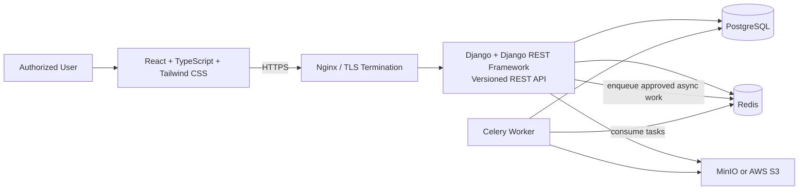
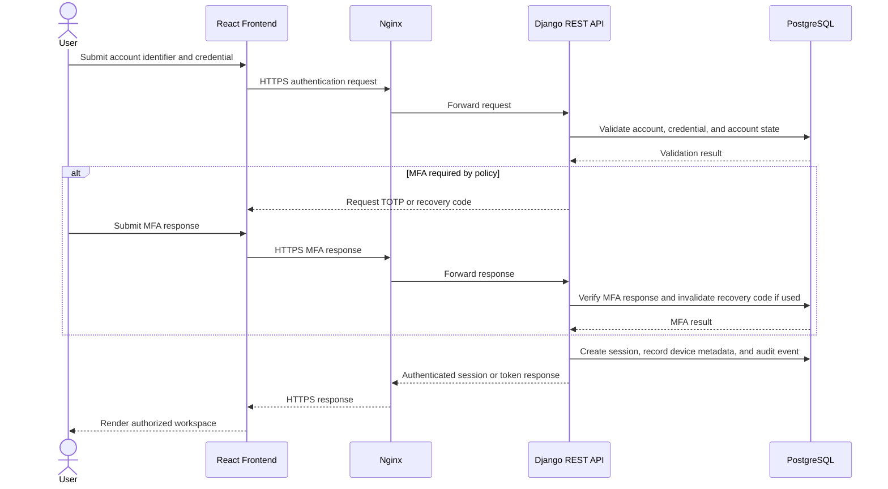
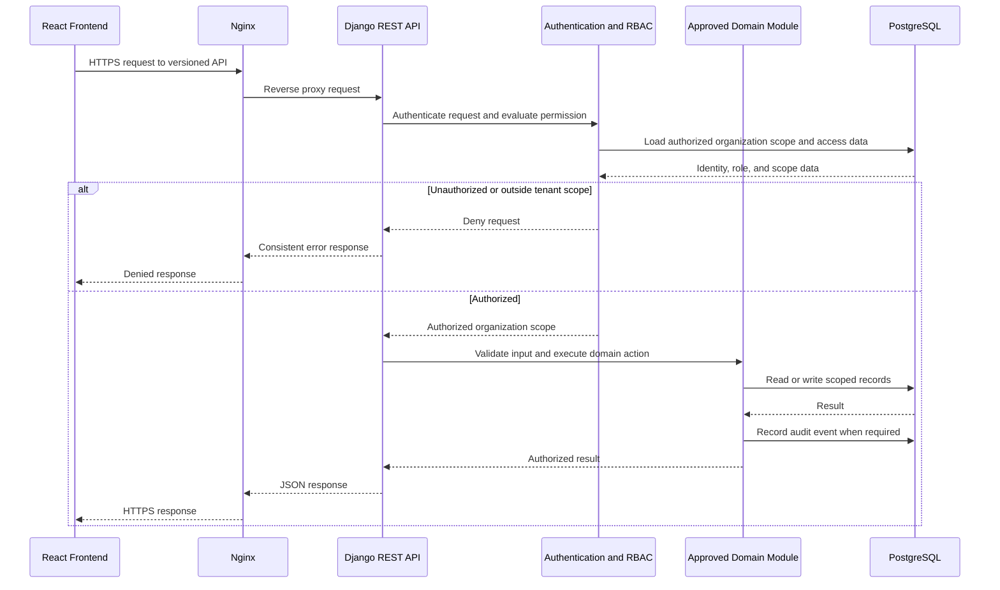
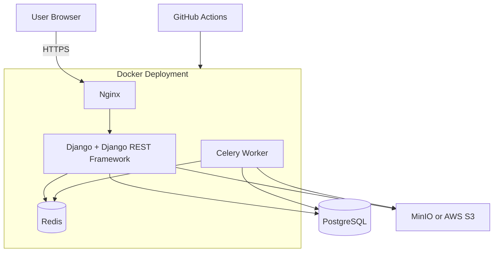

# SecureSphere System Architecture

## 1. Project Overview

SecureSphere is an enterprise-grade, multi-tenant cybersecurity SaaS platform. It centralizes organization-scoped security information so authorized users can manage assets, vulnerabilities, incidents, remediation work, audit records, notifications, dashboards, risk scores, and security policies.

This architecture implements the approved project vision and Software Requirements Specification (SRS) for Version 1.0. Its primary purpose is to provide a secure, maintainable, and auditable foundation for security posture and remediation management. It does not expand the approved product scope or introduce unapproved technologies.

## 2. Architectural Goals

- Enforce strong tenant isolation and server-side authorization for every protected operation.
- Keep security-sensitive actions auditable, traceable, and understandable.
- Separate presentation, API, domain, persistence, and background-processing concerns.
- Support the approved modules without coupling them unnecessarily.
- Provide reliable, organization-scoped dashboards, enterprise search, and risk views.
- Support independent scaling of web application and background-worker workloads.
- Use secure defaults for authentication, MFA, sessions, device trust, storage, and error handling.
- Provide a clear deployment boundary using Docker, Nginx, and GitHub Actions.

## 3. High-Level Architecture

SecureSphere is a browser-based application. The React frontend communicates with versioned Django REST Framework APIs through Nginx over HTTPS. Django contains the modular business and authorization logic, persists durable records in PostgreSQL, uses Redis for approved caching and queue coordination, and delegates asynchronous work to Celery workers. Approved uploaded objects and evidence files reside in MinIO or AWS S3.

## 4. Component Responsibilities

| Component | Responsibility |
| --- | --- |
| React frontend | Presents responsive, role-appropriate workflows and dashboards; submits user actions only through authenticated APIs. |
| Nginx | Terminates TLS as configured, reverse-proxies browser and API traffic, and provides the deployment entry point. |
| Django application | Applies domain rules, tenant scoping, authentication, authorization, validation, audit creation, and persistence orchestration. |
| Django REST Framework API | Exposes documented, versioned JSON REST endpoints with consistent request and error handling. |
| PostgreSQL | Stores durable, relational organization, identity, access, asset, vulnerability, incident, audit, notification, policy, and configuration records. |
| Redis | Supports approved caching and Celery queue coordination; it is not the system of record for durable security records. |
| Celery workers | Process approved asynchronous work, including eligible notification processing and other approved background tasks. |
| MinIO or AWS S3 | Stores approved evidence files and other uploaded objects outside the application container filesystem. |
| GitHub Actions | Executes defined build, test, security, and deployment workflows. |

## 5. Frontend Architecture

The frontend is a React and TypeScript application styled with Tailwind CSS. It is responsible for the user experience, client-side presentation state, form interaction, and API communication. It must not be the authority for authentication, authorization, tenant isolation, policy enforcement, or business rules.

Frontend features are organized around the approved user workflows:

- Authentication, email verification, password recovery, TOTP MFA, recovery codes, active sessions, and trusted devices.
- Organization, user, team, and role administration.
- Asset, vulnerability, and incident management.
- Dashboard widgets, risk-score presentation, notifications, audit-log review, and enterprise search.
- Configurable security-policy administration for authorized Organization Administrators.

The UI renders only information returned by the API and adapts available actions to the user’s permissions. Server-side authorization remains mandatory even when the frontend hides unavailable actions. Client-side validation improves usability but does not replace backend validation.

## 6. Backend Modular Architecture

The Django backend is a modular application organized by approved business capability. Each module owns its domain rules and uses shared platform services only for cross-cutting responsibilities such as authentication, RBAC authorization, tenant scoping, audit logging, validation, API versioning, and asynchronous task submission.

| Backend Module | Responsibility |
| --- | --- |
| Authentication and account security | Local authentication, email verification, password policy and recovery, TOTP MFA, recovery codes, sessions, and trusted devices. |
| Organization, users, teams, and RBAC | Organization lifecycle, membership, teams, roles, permissions, and organization-scoped access evaluation. |
| Asset management | Asset records, ownership, metadata, lifecycle, and relationships to vulnerabilities and incidents. |
| Vulnerability management | Vulnerability records, severity, ownership, affected assets, remediation state, and change history. |
| Incident management | Incident records, timelines, assignments, response actions, relationships, and activity history. |
| Dashboard and risk scoring | Authorized dashboard widgets, posture summaries, documented risk-score calculation, and supporting score context. |
| Audit, notifications, and search | Audit-event recording and review, in-application notifications, and authorization-filtered organization-scoped search. |
| Security-policy management | Organization security-policy records, lifecycle, configured values, and auditable change history. |

Modules communicate through explicit application services and durable relationships rather than presentation-layer dependencies. Business logic remains in backend domain and service layers; API views translate HTTP requests and responses, while the frontend remains a presentation client.

## 7. Data Storage Architecture

PostgreSQL is the system of record for relational data. All tenant-owned records carry or derive an organization scope. Data-access paths must enforce that scope before returning, updating, or deleting a record. Relationships preserve the links among assets, vulnerabilities, incidents, assignments, users, teams, audit events, and policies.

Redis supports approved cache entries and Celery queue coordination. Cached data must remain tenant-aware and authorization-safe; it must not bypass PostgreSQL-backed authorization or become the authoritative source for durable security data.

MinIO or AWS S3 stores approved evidence files and uploaded objects. Object metadata and ownership remain linked to organization-scoped records in PostgreSQL. Access to objects is authorized by the backend and restricted to permitted organization users.

Sensitive account-security data follows the SRS: local passwords use approved adaptive one-way hashing; TOTP secrets and recovery codes are protected at rest; recovery codes are single use; and logs exclude credentials, tokens, secrets, and unnecessary sensitive data.

## 8. Authentication Flow

Authentication is completed server-side. A successful credential check may require verified email ownership and TOTP MFA according to platform policy. On successful completion, the backend creates an authenticated session or token, records the associated device and session metadata, and writes the required audit event. The frontend receives only the result needed to continue the authorized workflow.

Password recovery does not reveal whether an account identifier exists. MFA-management, recovery-code regeneration, session revocation, and trusted-device changes require the authorization, anti-forgery protection where applicable, and re-authentication required by the SRS.

## 9. Request Lifecycle

Every protected request follows the same control sequence: secure transport, request parsing, authentication, authorization, tenant scoping, validation, domain execution, audit recording where required, persistence, and a consistent response. The backend is the enforcement point for RBAC and tenant isolation.

For file operations, the same authorization and organization-scope checks occur before object access is granted. For enterprise search, authorization filtering applies both to candidate retrieval and returned fields.

## 10. Background Task Processing

The Django application submits eligible asynchronous work to Redis for processing by Celery workers. Version 1.0 explicitly includes eligible notification processing and may process other approved asynchronous tasks without changing the system of record or bypassing access controls.

Workers consume tasks independently from web workers, retrieve only the organization-scoped data necessary to perform the task, persist resulting state in PostgreSQL when needed, and record auditable actions where required. Task payloads and logs must not expose passwords, tokens, secrets, or unnecessary customer data.

## 11. Deployment Architecture

SecureSphere deploys its approved components as Docker containers. Nginx receives HTTPS traffic and routes it to the Django application. Django web application containers and Celery worker containers can scale independently. PostgreSQL, Redis, and MinIO or AWS S3 provide the approved persistence, queue, cache, and object-storage interfaces. GitHub Actions runs defined CI/CD workflows for production-bound changes.

Operational environments must provide approved secrets, TLS certificates, backups, monitoring, network controls, recovery procedures, and retention controls as required by the SRS.

## 12. Trust Boundaries

| Boundary | Trust Decision and Required Controls |
| --- | --- |
| User browser to Nginx | Untrusted client input crosses into the platform through HTTPS; enforce TLS, request protections, and appropriate rate limiting. |
| Nginx to Django API | Reverse-proxied traffic enters application handling; the API must still authenticate, validate, and authorize every request. |
| Django API to PostgreSQL | Application services access durable data through parameterized, organization-scoped data access and least-privilege database credentials. |
| Django/Celery to Redis | Queue and cache access is limited to approved workloads; task data must be minimized and protected. |
| Django/Celery to object storage | Object operations require organization-scoped authorization and validated file-handling controls. |
| GitHub Actions to deployment | CI/CD access is restricted to approved workflows and managed secrets; deployment changes are subject to the defined quality and security checks. |

## 13. Scalability Considerations

- Django web application containers and Celery worker containers scale independently, matching the SRS requirement for separate web and background-worker scaling.
- PostgreSQL remains the durable relational system of record; data models and queries must preserve organization scoping and support approved dashboard, search, and reporting workloads.
- Redis reduces approved cache and queue pressure but cannot become an authorization bypass or authoritative store for durable security data.
- Dashboard widgets and organizational risk scores use documented inputs and timestamps so their results remain explainable as workloads grow.
- Enterprise search is limited to authorized, organization-scoped records and must meet performance targets defined before production release.
- Object storage externalizes approved uploaded files from application containers, allowing application deployments to remain stateless with respect to uploaded evidence.

## 14. Security Boundaries

Security is enforced in depth rather than delegated to a single layer:

- The browser is untrusted; frontend controls complement but never replace server-side validation and authorization.
- Authentication, email verification, password policy, TOTP MFA, recovery codes, sessions, and trusted-device management are protected account-security boundaries.
- Django and Django REST Framework are the final policy-enforcement point for RBAC, least privilege, tenant isolation, API versioning, validation, and consistent errors.
- Every organization-owned data path—including APIs, database queries, object storage, search, caches, and background jobs—must preserve organization scope.
- Audit logging provides a restricted, time-ordered record for defined security-relevant and administrative actions, including changes to account security, policies, and risk-score configuration.
- Sensitive data is minimized, protected in transit and at rest as required, and excluded from application logs.
- The deployment boundary uses TLS, managed secrets, approved network controls, health checks, backup, recovery, and retention procedures.

## 15. Technology Rationale

| Technology | Rationale within the Approved Design |
| --- | --- |
| React, TypeScript, Tailwind CSS | Provides the approved browser-based user interface stack for maintainable, typed, responsive workflows. |
| Django and Django REST Framework | Provides the approved backend and versioned REST API foundation for validation, authentication, authorization, and modular domain services. |
| PostgreSQL | Provides the approved durable relational system of record for security and organization data. |
| Redis and Celery | Provides the approved caching and asynchronous task-processing foundation, including notification processing. |
| Docker | Provides the approved container packaging model for deployable components. |
| Nginx | Provides the approved reverse-proxy and TLS-termination layer. |
| GitHub Actions | Provides the approved CI/CD workflow platform. |
| MinIO or AWS S3 | Provides approved object storage for evidence files and uploads outside application containers. |

## 16. Future Architecture

Future architecture changes are governed by the SRS and require separate product and security approval. They are out of scope for Version 1.0 and must not be assumed by current components:

- Enterprise single sign-on and automated user provisioning through approved identity-provider standards.
- Hardware security-key and passkey-based MFA.
- Automated device posture assessment and conditional access.
- External security-tool integrations for vulnerability ingestion, enrichment, and remediation orchestration.
- Advanced enterprise search, predictive risk analytics, threat-intelligence correlation, and custom risk-scoring models.
- Custom dashboard widgets, scheduled reporting, and customer-defined reporting packs.
- Policy-as-code, automated policy enforcement, and security-policy exception approvals.
- Regional data residency, expanded compliance mappings, and advanced retention controls.

Any future capability must preserve the current architectural principles: server-side authorization, tenant isolation, auditability, secure defaults, modular ownership, and clear operational boundaries.
