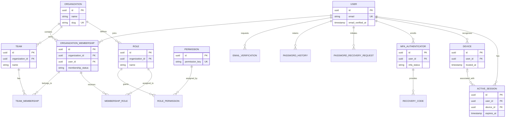
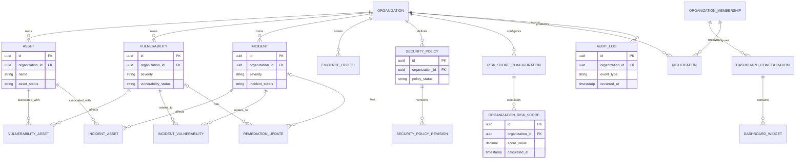

# SecureSphere Logical Database Design

## 1. Purpose and Scope

This document defines the logical PostgreSQL data design for SecureSphere Version 1.0. It is derived from the approved project vision, Software Requirements Specification (SRS), and system architecture. It describes business entities, logical attributes, relationships, identifier strategy, auditability, lifecycle handling, and indexing principles.

This is a logical design only. It does not prescribe Django models, SQL statements, database migrations, physical storage parameters, or unapproved technologies. Redis remains limited to approved caching and Celery queue coordination; it is not a durable source of record. MinIO or AWS S3 stores uploaded objects, while their authorized metadata and relationships are held in PostgreSQL.

## 2. Design Principles

- **Organization-scoped by default:** Tenant-owned entities are explicitly associated with one organization. Every access path must apply that organization scope.
- **UUID identifiers:** Durable business entities use UUID primary keys, enabling safe identifier generation across distributed application and worker processes without exposing sequential record volume.
- **Relational integrity:** Primary keys, foreign keys, required attributes, and relationship constraints protect core data consistency.
- **Auditable change:** Security-relevant and administrative actions create audit-log records. Material domain history is retained where required.
- **Least data:** Sensitive authentication material is minimized and stored only in the form required by the SRS.
- **Soft deletion where recovery matters:** Tenant-managed operational records are archived rather than physically deleted when the SRS requires lifecycle history or restoration.
- **Explicit associations:** Many-to-many relationships use named junction entities when the relationship has membership, assignment, ownership, status, or audit attributes.

## 3. Logical Conventions

### 3.1 Naming

Logical entity names are singular PascalCase (for example, `Organization`, `Vulnerability`). Logical attributes use lower snake case (for example, `organization_id`, `created_at`). Foreign-key attributes use the referenced entity name followed by `_id`.

Junction entities concatenate the participating entities or describe the business relationship, such as `OrganizationMembership`, `TeamMembership`, `MembershipRole`, `VulnerabilityAsset`, and `IncidentAsset`. Enumerated business states use a named `*_status` or `*_type` attribute with values governed by application policy.

### 3.2 UUID Primary-Key Strategy

Every durable entity listed in this document has an `id` attribute that is its UUID primary key unless explicitly stated otherwise. UUIDs are generated by trusted application or database mechanisms before persistence. UUIDs are opaque identifiers, not authorization tokens; access remains controlled by authenticated, organization-scoped server-side checks.

Foreign keys use the same UUID type as their referenced primary key. Natural values such as an email address, organization slug, or object-storage key are not primary keys.

### 3.3 Common Audit and Lifecycle Attributes

The following attributes are applied consistently according to entity type:

| Attribute | Use |
| --- | --- |
| `id` | UUID primary key. |
| `created_at` | UTC timestamp when the record was created. |
| `updated_at` | UTC timestamp of the most recent persisted change. |
| `created_by_membership_id` | Optional actor membership that created a tenant-owned business record, where meaningful. |
| `updated_by_membership_id` | Optional actor membership that last changed a tenant-owned business record, where meaningful. |
| `archived_at` | UTC timestamp indicating soft deletion or archival; `null` means active. |
| `archived_by_membership_id` | Optional actor membership that archived the record. |

`created_at` and `updated_at` apply to mutable durable entities. `archived_at` and `archived_by_membership_id` apply only to entities identified in the soft-delete strategy. Immutable audit and history entities use `created_at` but are not updated or archived through ordinary application workflows.

## 4. Entity Catalog

### 4.1 Identity, Organization, Team, and RBAC Entities

| Entity | Purpose | Core Attributes |
| --- | --- | --- |
| `User` | Global authenticated person account. A user can participate in one or more organizations. | `id`, `email`, `password_hash` when local passwords are used, `is_active`, `email_verified_at`, `last_authenticated_at`, `created_at`, `updated_at` |
| `Organization` | Tenant boundary and organization profile. | `id`, `name`, `slug`, `organization_status`, `created_at`, `updated_at`, `archived_at`, `archived_by_membership_id` |
| `OrganizationMembership` | A user’s organization-scoped membership, lifecycle, and principal for tenant actions. | `id`, `organization_id` FK, `user_id` FK, `membership_status`, `joined_at`, `deactivated_at`, `created_at`, `updated_at` |
| `Team` | Organization-scoped group used for work ownership and response coordination. | `id`, `organization_id` FK, `name`, `description`, `team_status`, audit and archival attributes |
| `TeamMembership` | Explicit many-to-many membership of organization members in teams. | `id`, `team_id` FK, `organization_membership_id` FK, `joined_at`, `created_at` |
| `Role` | Named organization-scoped or approved platform-level role definition. | `id`, `organization_id` FK nullable only for approved platform roles, `name`, `description`, `role_status`, audit and archival attributes |
| `Permission` | Named permission that can be granted through a role. | `id`, `permission_key`, `description`, `created_at`, `updated_at` |
| `RolePermission` | Explicit many-to-many role-to-permission grant. | `id`, `role_id` FK, `permission_id` FK, `created_at` |
| `MembershipRole` | Explicit many-to-many assignment of roles to an organization membership. | `id`, `organization_membership_id` FK, `role_id` FK, `assigned_at`, `assigned_by_membership_id` FK nullable, `created_at` |

`OrganizationMembership` is the tenant-scoped principal used for ownership, assignment, actor, and audit references. A global `User` does not directly own tenant records; ownership is represented through the user’s active membership in the relevant organization.

### 4.2 Account Security, Devices, and Sessions

| Entity | Purpose | Core Attributes |
| --- | --- | --- |
| `EmailVerification` | Verifiable, time-limited email-ownership confirmation record. | `id`, `user_id` FK, `verification_token_digest`, `requested_at`, `expires_at`, `verified_at`, `created_at` |
| `PasswordHistory` | Historic password-hash record used to enforce approved password-reuse policy. | `id`, `user_id` FK, `password_hash`, `set_at`, `created_at` |
| `PasswordRecoveryRequest` | Time-limited account-recovery request that does not disclose account existence externally. | `id`, `user_id` FK nullable until safely associated internally, `recovery_token_digest`, `requested_at`, `expires_at`, `used_at`, `created_at` |
| `MfaAuthenticator` | User’s TOTP MFA enrollment and lifecycle record. | `id`, `user_id` FK, `totp_secret_protected`, `mfa_status`, `enrolled_at`, `verified_at`, `disabled_at`, `created_at`, `updated_at` |
| `RecoveryCode` | Single-use MFA recovery code record. Plaintext is never persisted. | `id`, `mfa_authenticator_id` FK, `code_digest`, `generated_at`, `used_at`, `revoked_at`, `created_at` |
| `Device` | Recognized browser or client environment associated with a user. | `id`, `user_id` FK, `device_label`, `device_metadata`, `first_seen_at`, `last_seen_at`, `trusted_at`, `revoked_at`, `created_at`, `updated_at` |
| `ActiveSession` | Authenticated session or token lifecycle record associated with a user and optionally a device. | `id`, `user_id` FK, `device_id` FK nullable, `session_token_digest` or approved session reference, `issued_at`, `last_seen_at`, `expires_at`, `revoked_at`, `revocation_reason`, `created_at`, `updated_at` |

Account-security records are globally user-scoped rather than organization-owned. Administrative and user actions affecting these entities are recorded through `AuditLog`. Protected credential, token, TOTP, and recovery-code values are never stored in plaintext.

### 4.3 Security Operations Entities

| Entity | Purpose | Core Attributes |
| --- | --- | --- |
| `Asset` | Organization-scoped security-relevant resource, system, application, service, or data store. | `id`, `organization_id` FK, `name`, `asset_type`, `asset_status`, `owner_membership_id` FK nullable, `business_context`, `technical_metadata`, audit and archival attributes |
| `Vulnerability` | Organization-scoped security issue requiring assessment and remediation. | `id`, `organization_id` FK, `title`, `description`, `severity`, `vulnerability_status`, `owner_membership_id` FK nullable, `owner_team_id` FK nullable, `remediation_target_at`, audit and archival attributes |
| `VulnerabilityAsset` | Explicit many-to-many association between vulnerabilities and affected assets. | `id`, `vulnerability_id` FK, `asset_id` FK, `created_at` |
| `Incident` | Organization-scoped confirmed or suspected security event requiring tracking and response. | `id`, `organization_id` FK, `title`, `description`, `severity`, `incident_status`, `owner_membership_id` FK nullable, `response_team_id` FK nullable, `opened_at`, `contained_at`, `resolved_at`, `resolution_summary`, audit and archival attributes |
| `IncidentAsset` | Explicit many-to-many association between incidents and affected assets. | `id`, `incident_id` FK, `asset_id` FK, `created_at` |
| `IncidentVulnerability` | Explicit many-to-many association between incidents and related vulnerabilities. | `id`, `incident_id` FK, `vulnerability_id` FK, `created_at` |
| `RemediationUpdate` | Append-only progress update for a vulnerability or incident, including comments, status changes, and assigned ownership context. | `id`, `organization_id` FK, `vulnerability_id` FK nullable, `incident_id` FK nullable, `author_membership_id` FK, `update_text`, `previous_status`, `new_status`, `previous_owner_membership_id` FK nullable, `new_owner_membership_id` FK nullable, `previous_owner_team_id` FK nullable, `new_owner_team_id` FK nullable, `created_at` |
| `EvidenceObject` | Metadata and authorization link for an approved uploaded object stored in MinIO or AWS S3. | `id`, `organization_id` FK, `storage_key`, `original_filename`, `content_type`, `size_bytes`, `uploaded_by_membership_id` FK, `vulnerability_id` FK nullable, `incident_id` FK nullable, `created_at`, `archived_at`, `archived_by_membership_id` |

`RemediationUpdate` must reference exactly one parent: either a `Vulnerability` or an `Incident`. `EvidenceObject` may be linked to a vulnerability, incident, or retained as an organization-scoped record until attached by an authorized workflow. All referenced parent records must belong to the same organization.

### 4.4 Dashboards, Risk, Policies, Audit, and Notifications

| Entity | Purpose | Core Attributes |
| --- | --- | --- |
| `DashboardConfiguration` | User-specific, organization-scoped dashboard layout and configuration. | `id`, `organization_id` FK, `organization_membership_id` FK, `created_at`, `updated_at` |
| `DashboardWidget` | Configured instance of an approved dashboard widget. | `id`, `dashboard_configuration_id` FK, `widget_type`, `display_order`, `widget_configuration`, `created_at`, `updated_at` |
| `RiskScoreConfiguration` | Traceable organization-level configuration for the approved risk-score methodology. | `id`, `organization_id` FK, `configuration_version`, `weight_configuration`, `effective_at`, `configured_by_membership_id` FK, `created_at`, `updated_at`, `archived_at`, `archived_by_membership_id` |
| `OrganizationRiskScore` | Timestamped organization risk-score result and explanatory input summary. | `id`, `organization_id` FK, `risk_score_configuration_id` FK, `score_value`, `calculated_at`, `contributor_summary`, `created_at` |
| `SecurityPolicy` | Configurable security policy managed by an authorized Organization Administrator. | `id`, `organization_id` FK, `name`, `description`, `policy_status`, `applicable_scope`, `configured_values`, `owner_membership_id` FK, `effective_at`, audit and archival attributes |
| `SecurityPolicyRevision` | Append-only, traceable version of a security policy’s configured values and lifecycle-relevant content. | `id`, `security_policy_id` FK, `revision_number`, `name_snapshot`, `description_snapshot`, `policy_status_snapshot`, `applicable_scope_snapshot`, `configured_values_snapshot`, `effective_at`, `changed_by_membership_id` FK, `created_at` |
| `AuditLog` | Restricted, append-only record of defined security-relevant and administrative events. | `id`, `organization_id` FK nullable for global account events, `actor_user_id` FK nullable, `actor_membership_id` FK nullable, `event_type`, `target_entity_type`, `target_entity_id`, `event_metadata`, `occurred_at`, `created_at` |
| `Notification` | In-application notification relevant to a user’s organization membership. | `id`, `organization_id` FK, `recipient_membership_id` FK, `notification_type`, `title`, `message`, `related_entity_type`, `related_entity_id`, `created_at`, `acknowledged_at` |

Enterprise search is not represented as a separate system-of-record entity in Version 1.0. It queries approved organization-scoped PostgreSQL records and returns only result types and fields authorized for the requesting membership. Any implementation-specific search cache must remain tenant-aware and authorization-safe.

## 5. Relationships and Cardinality

### 5.1 Identity and Access Relationships

- One `User` has zero or many `OrganizationMembership` records; each `OrganizationMembership` belongs to exactly one `User` and one `Organization`.
- One `Organization` has zero or many memberships, teams, tenant roles, assets, vulnerabilities, incidents, policies, dashboard configurations, risk configurations, risk scores, notifications, evidence objects, and tenant audit events.
- `Team` and `OrganizationMembership` have a many-to-many relationship through `TeamMembership`.
- `Role` and `Permission` have a many-to-many relationship through `RolePermission`.
- `OrganizationMembership` and `Role` have a many-to-many relationship through `MembershipRole`. A role assignment must reference a role valid for that membership’s organization or an approved platform-level role.
- One `User` has zero or many email verifications, password-history entries, recovery requests, MFA authenticators, devices, and active sessions.
- One `MfaAuthenticator` has zero or many recovery codes; each recovery code belongs to exactly one authenticator.
- One `Device` has zero or many active sessions; an active session belongs to one user and may reference one device.

### 5.2 Security Operations Relationships

- One `Organization` has zero or many assets, vulnerabilities, and incidents.
- `Vulnerability` and `Asset` have a many-to-many relationship through `VulnerabilityAsset`.
- `Incident` and `Asset` have a many-to-many relationship through `IncidentAsset`.
- `Incident` and `Vulnerability` have a many-to-many relationship through `IncidentVulnerability`.
- A vulnerability may be assigned to one organization membership, one team, or both when the approved workflow requires a direct accountable owner and a coordinating team; all assignments must be within the same organization.
- An incident may be owned by one organization membership and/or coordinated by one response team within the same organization.
- A vulnerability or incident has zero or many `RemediationUpdate` records; each update belongs to exactly one of those parent types and one author membership.
- An `EvidenceObject` belongs to one organization and may be related to an approved vulnerability or incident in that same organization.

### 5.3 Dashboard, Risk, Policy, and Operational Relationships

- One `OrganizationMembership` has zero or many `DashboardConfiguration` records only if future approved workflows allow more than one; Version 1.0 should enforce at most one active configuration per membership and organization.
- One `DashboardConfiguration` has zero or many `DashboardWidget` records.
- One `Organization` has zero or many `RiskScoreConfiguration` records and zero or many `OrganizationRiskScore` snapshots. Each score snapshot references the configuration used to calculate it.
- One `Organization` has zero or many `SecurityPolicy` records; each policy has one or many `SecurityPolicyRevision` records.
- One organization membership has zero or many notifications and may act in many audit-log events.
- `AuditLog` uses a typed target reference to record the affected entity without imposing a false relational relationship on unrelated entity types. When a target is organization-owned, the audit record’s `organization_id` must match the target’s organization.

## 6. Mermaid ER Diagrams

### 6.1 Identity, Access, and Account Security

### 6.2 Security Operations and Governance

## 7. Primary Keys, Foreign Keys, and Integrity Rules

### 7.1 Primary and Unique Keys

- Every catalog entity uses `id` as its UUID primary key.
- `User.email` is unique after normalization according to approved account policy.
- `Organization.slug` is unique.
- `OrganizationMembership` is unique on (`organization_id`, `user_id`) so a user has one membership lifecycle record per organization.
- `TeamMembership` is unique on (`team_id`, `organization_membership_id`).
- `RolePermission` is unique on (`role_id`, `permission_id`).
- `MembershipRole` is unique on (`organization_membership_id`, `role_id`).
- `VulnerabilityAsset`, `IncidentAsset`, and `IncidentVulnerability` are each unique on their two foreign-key attributes.
- `DashboardWidget` is unique on (`dashboard_configuration_id`, `display_order`) to preserve deterministic layout order.
- `RiskScoreConfiguration` is unique on (`organization_id`, `configuration_version`).
- `SecurityPolicyRevision` is unique on (`security_policy_id`, `revision_number`).

### 7.2 Foreign-Key Rules

- All foreign keys reference UUID primary keys.
- Tenant-owned child records must reference a parent in the same organization. This applies to ownership, team, actor, evidence, update, dashboard, notification, and policy relationships.
- A membership used as an asset owner, vulnerability owner, incident owner, update author, notification recipient, or policy actor must belong to the same organization as the record.
- A team used as a vulnerability owner or incident response team must belong to the same organization as the record.
- An evidence object’s linked vulnerability or incident, if present, must belong to the evidence object’s organization.
- A role referenced by `MembershipRole` must be organization-valid for that membership; an organization-scoped role cannot be assigned across organizations.
- Parent records with retained audit or historical dependencies are not physically deleted by ordinary workflows.

### 7.3 Business Constraints

- `RemediationUpdate` references exactly one of `vulnerability_id` or `incident_id`.
- A recovery code may transition from unused to used or revoked but may not become usable again.
- An active session with a non-null `revoked_at` is not valid, regardless of its nominal expiration time.
- A device with a non-null `revoked_at` cannot be treated as trusted.
- Only one current MFA authenticator may be active for a user unless a future approved requirement explicitly permits multiple authenticators.
- A policy revision is append-only; a new policy change creates a new revision rather than overwriting historic configured values.
- Organization risk-score snapshots retain the configuration reference and calculation time used for the result.

## 8. Soft Delete and Retention Strategy

Soft deletion is used for organization-managed records where the approved requirements call for archive, restore, history, or auditability. The standard soft-delete marker is `archived_at`; active queries filter for `archived_at is null` while authorized administrative workflows may review or restore archived records.

| Entity Group | Strategy |
| --- | --- |
| Organizations, teams, roles, assets | Soft delete through archival. Restore is permitted only where the approved workflow allows it. |
| Vulnerabilities and incidents | Preserve the workflow lifecycle through status and closure; archival is available for retention management without losing history. |
| Evidence objects | Archive metadata and revoke logical access; object-storage lifecycle handling follows approved retention procedures. |
| Memberships | Deactivate through `membership_status` and `deactivated_at`; retain history for access and audit purposes. |
| Users | Deactivate through `is_active`; do not remove records that are referenced by required audit history. |
| Sessions, devices, MFA authenticators, recovery codes, verification and recovery requests | Revoke, expire, disable, or mark used; do not rely on hard deletion to end security validity. |
| Audit logs, remediation updates, policy revisions, risk-score snapshots, password history | Append-only or retained historical records; no ordinary soft delete. |
| Notifications | Acknowledge through `acknowledged_at`; retention follows approved policy rather than user-driven deletion. |

Physical deletion, backup retention, and object-storage lifecycle rules are operational decisions governed by the SRS’s approved retention and recovery procedures. They must not undermine required audit trails or tenant isolation.

## 9. Indexing Strategy

Indexes support authorized organization-scoped reads, relationship traversal, dashboard summaries, audit review, and approved search. Exact physical index definitions remain an implementation decision; the following are logical requirements.

| Access Pattern | Logical Indexing Requirement |
| --- | --- |
| Tenant data retrieval | Index `organization_id` on every organization-owned entity. For active operational entities, support combined scope and lifecycle access such as (`organization_id`, `archived_at`) or the equivalent active-record strategy. |
| Membership and RBAC evaluation | Index `OrganizationMembership.user_id`, unique membership pair, `MembershipRole.organization_membership_id`, `MembershipRole.role_id`, `RolePermission.role_id`, and `RolePermission.permission_id`. |
| Team membership | Index both foreign keys on `TeamMembership`; preserve the unique pair constraint. |
| Authentication and recovery | Unique normalized `User.email`; index active session lookup by `user_id`, expiration, and revocation state; index device lookup by `user_id` and revocation state; index unexpired verification and recovery requests by user and expiration. |
| Asset and vulnerability workflows | Index asset and vulnerability `organization_id` with common filter attributes such as status, severity, owner, team, and remediation target date. Index junction-table foreign keys in both traversal directions. |
| Incident workflows | Index incident `organization_id` with status, severity, owner, response team, and relevant lifecycle timestamps. Index incident junction-table foreign keys in both traversal directions. |
| Dashboard and risk views | Index organization-scoped active assets, vulnerabilities, and incidents by the dimensions used in approved widgets; index risk scores by (`organization_id`, `calculated_at`). |
| Audit review | Index `AuditLog` by (`organization_id`, `occurred_at`), actor, event type, and typed target reference where available. |
| Notifications | Index `Notification` by (`recipient_membership_id`, `acknowledged_at`, `created_at`). |
| Enterprise search | Use organization-scoped indexes for approved searchable fields on assets, vulnerabilities, incidents, users, teams, and audit logs. Search retrieval must apply authorization filtering before results or fields are returned. |

Index selection must be reviewed against query plans, write volume, retention requirements, and tenant-isolation behavior before production release. Indexes must not expose or enable cross-organization search paths.

## 10. Data Security and Audit Considerations

- All tenant-owned rows are logically partitioned by `organization_id` and accessed only after server-side authentication, RBAC evaluation, and tenant-scope enforcement.
- `AuditLog` records defined account-security, access-management, security-record, policy, session, trusted-device, MFA, recovery-code, and risk-configuration events. It is restricted and append-only through ordinary workflows.
- Passwords, session credentials, verification tokens, recovery tokens, and recovery codes are represented only by approved protected values or digests; plaintext values are never persisted or logged.
- TOTP secrets are protected at rest and are not displayed after enrollment.
- `event_metadata`, `technical_metadata`, `weight_configuration`, `configured_values`, `contributor_summary`, and widget configuration must be validated, minimized, and treated as sensitive structured data where they include security context.
- Object-storage keys are metadata, not access grants. Every object operation must verify organization scope and authorization through PostgreSQL-backed records.
- The database design supports API versioning by keeping API representation separate from durable entity identity; API versions do not require duplicate business entities.

## 11. Logical Design Boundaries

This design deliberately does not add data structures for out-of-scope Version 1.0 capabilities, including external scanner ingestion, ticketing integrations, enterprise single sign-on and provisioning, hardware-key or passkey MFA, device posture assessment, automated remediation, predictive analytics, custom risk models, custom dashboard widgets, policy-as-code, or regional data-residency mechanisms.

Any future entity or relationship must preserve the approved architecture’s core rules: UUID identifiers, explicit organization scope, server-side authorization, least privilege, auditability, secure data handling, and operationally explainable relationships.
